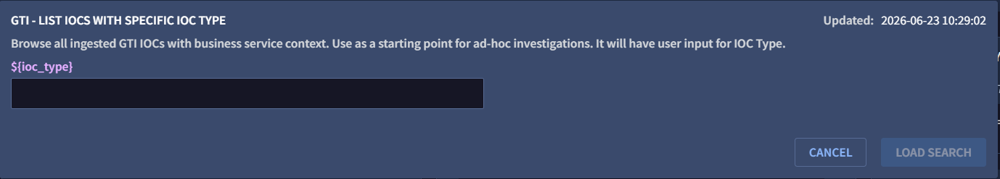

# Google Threat Intelligence Saved Searches for Google SecOps SIEM

After the data is ingested into Google SecOps SIEM as events, you can use predefined search queries to visualize and analyze the data. Google Threat Intelligence provides 5 search queries that you can modify or copy to get started. You can find the Google Threat Intelligence search queries in the following [GitHub](https://github.com/VirusTotal/gti-google-secops-siem/tree/main/Search%20Searches) repository or in the SIEM User Guide.

## Create a New Search Query

1. From Google SecOps SIEM, navigate to **Investigation** > **SIEM Search**.
2. Go to **Search Manager**, click on **+** icon.
3. Copy and paste the Search Query in **UDM SEARCH**, Title in **Title** and Description in **Description** from the Search Queries listed in [GitHub](https://github.com/VirusTotal/gti-google-secops-siem/tree/main/Search%20Searches) repository or from the SIEM User guide.
4. Click on **SAVE EDITS**.

## Saved Search with input
The [List IOCs by Type](./list_iocs_by_type.yl2) saved search accepts a user input for the `${ioc_type}` variable.
On saving this saved search and loading it in SIEM Search on Google SecOps platform will result in a pop-up like below, prompting you to enter an IOC type before running the search.

Possible values for `${ioc_type}`:
- DOMAIN_NAME
- FILE
- IP_ADDRESS
- URL

See [Google SecOps: Saved Searches](https://security.googlecloudcommunity.com/community-blog-42/new-to-google-secops-saved-searches-4047) for more information.
